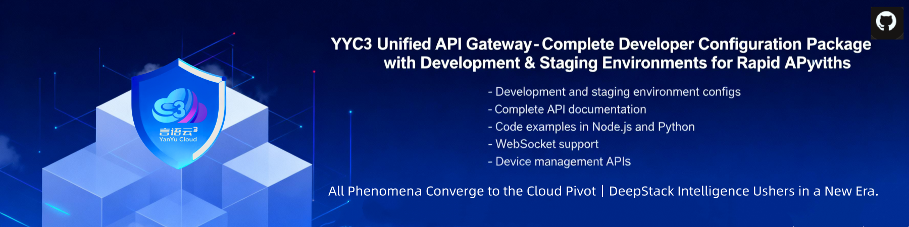

<div align="center">



# YYC³ API Gateway Configuration

[](https://github.com/YYC-Cube/yyc3-api-config/releases)
[](LICENSE)
[](https://api.0379.world/health)
[](https://nodejs.org/)
[](https://github.com/YYC-Cube/yyc3-api-config)

**Complete Developer Configuration Package for YYC³ Unified API Gateway**

[Quick Start](#-quick-start) • [Documentation](#-documentation) • [Examples](#-usage-examples) • [Support](#-support)

---

## 📖 Overview

YYC³ API Gateway Configuration provides ready-to-use environment configurations for seamless integration with YYC³ Unified API Gateway. This package enables developers to quickly connect to powerful AI services including Qwen, Zhipu, and Ollama.

> **Note**: This is a **configuration package**, not a standalone application. Copy the configuration files to your project and integrate with your existing codebase.

### ✨ Features

- 🚀 **Multi-Environment Support** - Development, Staging, and Production configurations
- 🔐 **Secure Configuration** - Pre-configured security settings and API key management
- 📚 **Comprehensive Documentation** - Detailed guides and code examples
- 🌐 **WebSocket Support** - Real-time communication capabilities
- 📱 **Device Management** - Integrated device control and monitoring
- 🔧 **Easy Integration** - Simple setup with minimal configuration

### 🎯 Supported Services

| Service | Provider | Status |
|----------|-----------|--------|
| Qwen AI | Alibaba Cloud | ✅ Active |
| Zhipu AI | Zhipu AI | ✅ Active |
| Ollama | Local | ✅ Active |
| Device Management | YYC³ | ✅ Active |
| WebSocket | Real-time | ✅ Active |

---

## 📦 Package Contents

```
yyc3-api-config/
├── .env.development       # Development environment configuration
├── .env.staging          # Staging environment configuration
├── .env.production       # Production environment configuration
├── .gitignore           # Git ignore file template
├── config.example.md     # Configuration usage examples
├── LICENSE              # MIT License
├── API使用记录模板.md    # API usage record template
├── YYC³-API-开发者配置包使用指南.md  # Developer configuration package usage guide
├── YYC³-API-使用记录与跟踪指南.md  # API usage record and tracking guide
├── pubilc/             # Images and assets
│   ├── API-Integration.png
│   ├── API-Integration-001.png
│   └── yyc3-badge-icons/
│       ├── Android/
│       ├── iOS/
│       ├── macOS/
│       ├── Web App/
│       └── Web-Pwa/
└── README.md           # This file
```

---

## 🚀 Quick Start

### Prerequisites

- Node.js >= 18.0.0
- npm or yarn
- Git

### Installation

```bash
# Clone repository
git clone https://github.com/YYC-Cube/yyc3-api-config.git

# Navigate to directory
cd yyc3-api-config

# Choose your environment
cp .env.development .env    # For development
# or
cp .env.staging .env         # For staging
```

### Usage in Your Project

```bash
# Copy environment configuration to your project
cp .env /path/to/your/project/

# Copy example configuration to your project
cp config.example.md /path/to/your/project/

# Install dependencies in your project
cd /path/to/your/project
npm install dotenv axios

# Load environment variables in your code
require('dotenv').config();
```

### Verification

```bash
# Verify configuration
cat .env

# Test API connection
curl $API_BASE_URL/health
```

---

## 📋 Environment Configurations

### Development Environment

**Purpose**: Local development and testing

**Configuration**:
- API URL: `http://localhost:3200`
- WebSocket: `ws://localhost:3200/ws`
- Log Level: `debug`
- Rate Limit: 1000 requests/minute
- JWT Expiry: 24 hours
- Swagger: ✅ Enabled
- Debug Mode: ✅ Enabled

**Use Cases**:
- Local development
- Feature testing
- API debugging

### Staging Environment

**Purpose**: Integration testing and pre-release

**Configuration**:
- API URL: `https://test-api.0379.world`
- WebSocket: `wss://test-api.0379.world/ws`
- Log Level: `info`
- Rate Limit: 500 requests/minute
- JWT Expiry: 3 days
- Swagger: ✅ Enabled
- Debug Mode: ❌ Disabled

**Use Cases**:
- Integration testing
- Pre-release validation
- Performance testing

### Production Environment

**Purpose**: Production deployment and user access

**Configuration**:
- API URL: `https://api.0379.world`
- WebSocket: `wss://api.0379.world/ws`
- Log Level: `warn`
- Rate Limit: 300 requests/minute
- JWT Expiry: 7 days
- Swagger: ❌ Disabled
- Debug Mode: ❌ Disabled

**Use Cases**:
- Production deployment
- User access
- High-availability services

---

## 💡 Usage Examples

### Node.js

```javascript
require('dotenv').config();
const axios = require('axios');

const apiClient = axios.create({
  baseURL: process.env.API_BASE_URL,
  headers: {
    'Content-Type': 'application/json'
  }
});

async function healthCheck() {
  try {
    const response = await apiClient.get('/health');
    console.log('Health check:', response.data);
    return response.data;
  } catch (error) {
    console.error('Health check failed:', error.message);
    throw error;
  }
}

healthCheck();
```

### Python

```python
import os
from dotenv import load_dotenv
import requests

load_dotenv()

API_BASE_URL = os.getenv('API_BASE_URL')

def health_check():
    try:
        response = requests.get(f'{API_BASE_URL}/health')
        print('Health check:', response.json())
        return response.json()
    except Exception as error:
        print('Error:', str(error))
        raise

health_check()
```

### cURL

```bash
# Load environment variables
source .env

# Health check
curl $API_BASE_URL/health

# Qwen chat API
curl -X POST $API_BASE_URL/api/v1/llm/qwen/chat \
  -H "Content-Type: application/json" \
  -d '{"messages":[{"role":"user","content":"Hello"}]}'
```

---

## 📊 API Endpoints

### Health Check

| Endpoint | Method | Description |
|----------|---------|-------------|
| `/health` | GET | API health status |

### LLM APIs

| Endpoint | Method | Description |
|----------|---------|-------------|
| `/api/v1/llm/qwen/chat` | POST | Qwen chat completion |
| `/api/v1/llm/zhipu/chat` | POST | Zhipu chat completion |
| `/api/v1/llm/ollama/chat` | POST | Ollama chat completion |
| `/api/v1/llm/models` | GET | List available models |

### Device Management

| Endpoint | Method | Description |
|----------|---------|-------------|
| `/api/v1/devices` | GET | List all devices |
| `/api/v1/devices/:id` | GET | Get device details |
| `/api/v1/devices/:id/control` | POST | Control device |
| `/api/v1/devices/:id/status` | GET | Get device status |

### System APIs

| Endpoint | Method | Description |
|----------|---------|-------------|
| `/api/v1/status` | GET | System status |
| `/api/v1/chat` | POST | Unified chat interface |
| `/api/v1/models` | GET | List all models |

### WebSocket

| Endpoint | Protocol | Description |
|----------|-----------|-------------|
| `/ws` | WS | WebSocket connection |

---

## 🔒 Security Best Practices

### 1. Protect Sensitive Information

```bash
# .gitignore
.env
.env.local
.env.*.local
```

### 2. Use Environment Variables

```javascript
// ❌ Bad: Hardcoded
const API_KEY = 'sk-af9aab1ac5084e0e91476def190f793d';

// ✅ Good: Environment variable
const API_KEY = process.env.QWEN_API_KEY;
```

### 3. API Key Management

- Never hardcode API keys
- Never commit `.env` files to public repositories
- Rotate API keys regularly
- Follow principle of least privilege

---

## 🔄 Environment Switching

### Switch to Development

```bash
# Copy development configuration
cp .env.development .env

# Restart application
npm run dev
```

### Switch to Staging

```bash
# Copy staging configuration
cp .env.staging .env

# Restart application
npm run test
```

### Switch to Production

```bash
# Copy production configuration
cp .env.production .env

# Restart application
npm run start
```

---

## 📚 Documentation

- [API Documentation](https://docs.0379.world)
- [Environment Configuration Guide](./config.example.md)
- [Developer Configuration Package Usage Guide](./YYC³-API-开发者配置包使用指南.md)
- [API Usage Record and Tracking Guide](./YYC³-API-使用记录与跟踪指南.md)
- [API Usage Record Template](./API使用记录模板.md)
- [Security Guidelines](#-security-best-practices)
- [API Reference](#-api-endpoints)

---

## 🤝 Contributing

We welcome contributions! Please follow these steps:

1. Fork the repository
2. Create a feature branch (`git checkout -b feature/amazing-feature`)
3. Commit your changes (`git commit -m 'Add amazing feature'`)
4. Push to the branch (`git push origin feature/amazing-feature`)
5. Open a Pull Request

### Development Guidelines

- Follow the existing code style
- Add tests for new features
- Update documentation as needed
- Ensure all tests pass

---

## 📞 Support

### Contact Information

- **Email**: admin@0379.email
- **Documentation**: [YYC³ API Docs](https://docs.0379.world)
- **Issues**: [GitHub Issues](https://github.com/YYC-Cube/yyc3-api-config/issues)

### API Endpoints

- **Development**: http://localhost:3200
- **Staging**: https://test-api.0379.world
- **Production**: https://api.0379.world

---

## 📄 License

This project is licensed under the MIT License - see the [LICENSE](LICENSE) file for details.

---

## 🙏 Acknowledgments

- YYC³ Team for API Gateway
- Alibaba Cloud for Qwen AI
- Zhipu AI for GLM models
- Ollama for local AI models

---

<div align="center">

**Built with ❤️ by [YYC³ Team](https://github.com/YYC-Cube)**

[⬆ Back to Top](#yyc-api-gateway-configuration)

</div>
